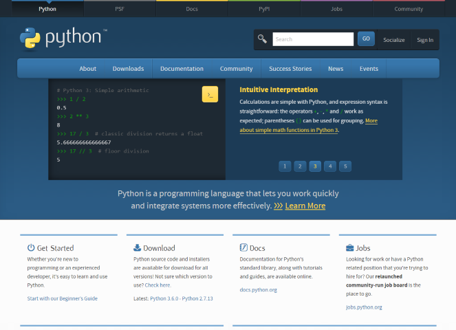
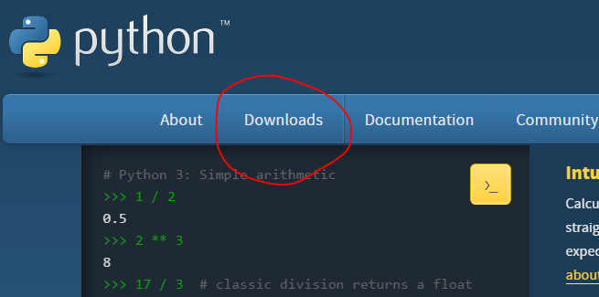
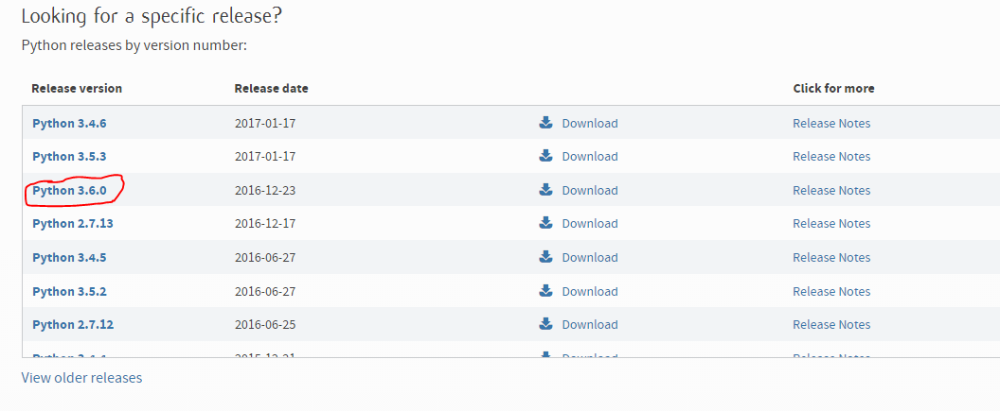
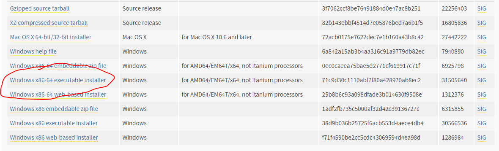

# YAGC -- Yet Another Git Clone

A crappy clone of Git. Supports only a few commands: `add`, `remove`, `commit`,
`checkout`, `reset`, `help`, `log`, `status`, and `init`.

Made as a final project for ICS3U.

---

# How to Install Python (Windows only)

## Step 1 - Go to `python.org`

Open a web browser and navigate to `python.org`.

## Step 2 - Download Python

Click on `Downloads`.

Click on `Python 3.6.0`.

Click on `Windows x86-64 executable installer`.

Your browser should start downloading the Python 3.6 installer.

## Step 3 - Install Python

Find the executable you downloaded and run it. Click through any Windows
warnings. Accept all the default options when clicking through the
installer. Eventually, Python should be installed on your machine.

## Step 4 - Use YAGC!

Double-click on `cmd-workaround.bat` in order to access the command line.
You can start by issuing the command `yagc help`.
